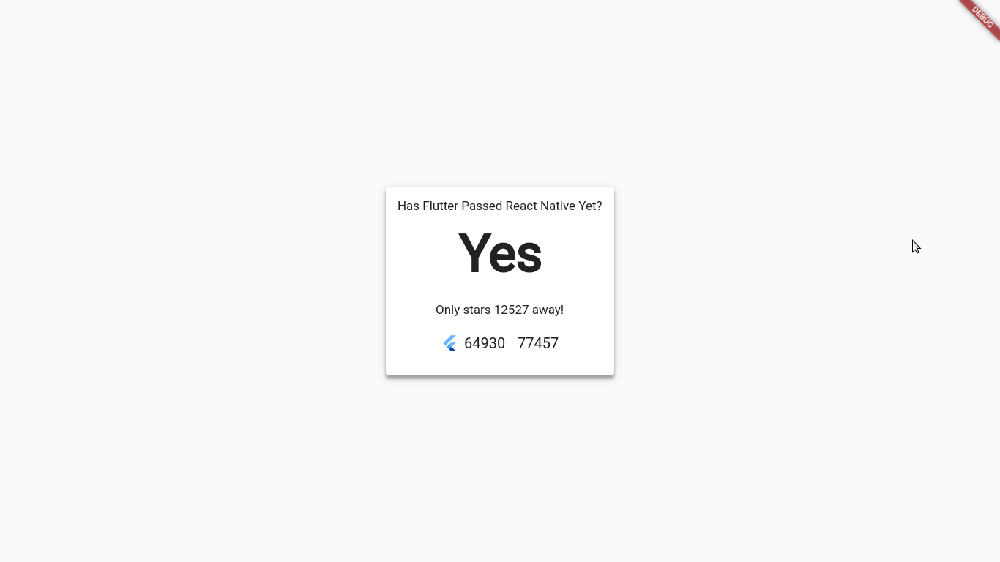

# Has Flutter passed React Native yet?

> :dart: A [Flutter Web](https://flutter.dev/web) App to compare :left_right_arrow: GitHub stars of Flutter and React Native



## Development Tools
- [Flutter for Web](https://flutter.dev/web)
- [IntelliJ IDEA](https://www.jetbrains.com/idea)

## Development
```
$ git clone https://github.com/piedcipher/hasFlutterPassedReactNativeYet-FlutterWeb.git
$ cd hasFlutterPassedReactNativeYet-FlutterWeb
$ pub get &&  webdev serve --auto restart
```

## Todo
- [ ] Visual Polish
- [ ] Refresh Button
- [ ] Deployment

## Inspired By
- [hasvuepassedreactyet](https://github.com/stursby/hasvuepassedreactyet) Created by [Charlie Hield](https://github.com/stursby/)
- [hasFlutterPassedReactNativeYet](https://github.com/piedcipher/hasFlutterPassedReactNativeYet) Created by me.
